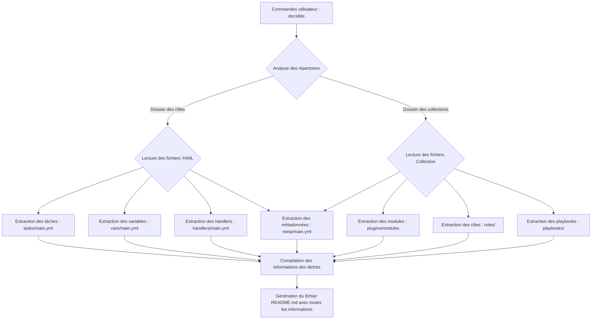

# **Docsible**

*Automatisez la documentation de vos rôles Ansible pour des processus DevOps optimisés et sans effort manuel.*

---
transition: slide-up
---

# Contexte et objectif
<v-click>

- Le défi : Gérer un grand nombre de rôles Ansible en évolution constante, augmentant la complexité de la documentation.
</v-click>
<v-click>

- Délais serrés : Maintenir une documentation à jour dans un environnement où les versions et les configurations changent rapidement.
</v-click>
<v-click>

- Documentation manuelle : Un processus fastidieux, sujet aux erreurs et difficilement scalable avec les besoins croissants de conformité et de standardisation.
</v-click>

## Pourquoi Docsible ?
<v-click>

- Évolution rapide des environnements Ansible, rendant la documentation difficile à suivre.
</v-click>
<v-click>

- Besoin d’une documentation à jour en continu pour faciliter la collaboration et l’intégration.
</v-click>
<v-click>

- Automatisation pour gagner du temps en éliminant les tâches répétitives et manuelles.
</v-click>
<v-click>

- **Alignement avec le code** : Une documentation toujours synchronisée avec le code source, réduisant les risques d’incohérence et d'erreurs de configuration.
</v-click>
---
transition: slide-up
level: 2
---

# Docsible : Une solution clé pour le DevOps
<v-click>

- Outil open-source conçu pour automatiser la génération de documentation directement depuis les rôles et collections Ansible.
</v-click>
<v-click>

- Gain de temps : Plus de documentation manuelle, tout est généré automatiquement avec chaque changement de code.
</v-click>
<v-click>

- Documentation intégrée au pipeline CI/CD, toujours à jour, et prête à être consultée par les équipes DevOps et d’intégration.
</v-click>

---
transition: fade-out
---

# Fonctionnement de Docsible
<v-click>

1. Analyse des rôles et tâches Ansible : Extraction des informations clés du code.
</v-click>
<v-click>

2. Extraction des métadonnées : Collecte des descriptions, variables, et autres détails pour une documentation complète.
</v-click>
<v-click>

3. Génération automatique de README : Format structuré et lisible, toujours aligné avec l’état actuel du code.
</v-click>
<v-click>

4. Visualisation : Création de diagrammes pour illustrer les flux de tâches, offrant une vue d’ensemble rapide et compréhensible des workflows.
</v-click>

---
---

---
transition: slide-left
---

# Demo github

- Rôle : [docsible/thermo-core](https://github.com/docsible/thermo-core)

---
transition: slide-left
---

# Merci de votre attention !

<v-click>Des questions ?</v-click>